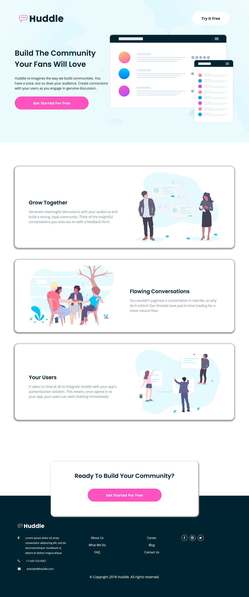
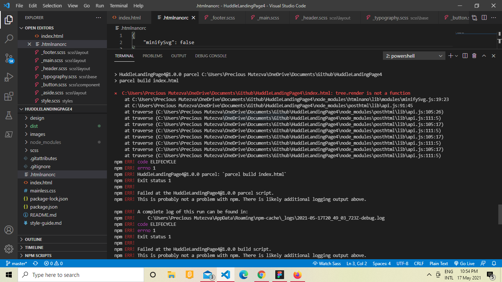

# Frontend Mentor - Stats preview card component solution

This is a solution to the [Stats preview card component challenge on Frontend Mentor](https://www.frontendmentor.io/challenges/huddle-landing-page-with-alternating-feature-blocks-5ca5f5981e82137ec91a5100). Frontend Mentor challenges help you improve your coding skills by building realistic projects. 

## Table of contents

- [Overview](#overview)
  - [The challenge](#the-challenge)
  - [Screenshot](#screenshot)
  - [Links](#links)
- [My process](#my-process)
  - [Built with](#built-with)
  - [What I learned](#what-i-learned)
  - [Continued development](#continued-development)
  - [Useful resources](#useful-resources)
- [Author](#author)
- [Acknowledgments](#acknowledgments)


## Overview

### The challenge

Users should be able to:

- View the optimal layout depending on their device's screen size
- accessible to assistive technology users

### Screenshot




### Links

- [live site URL](https://chamumutezva.github.io/HuddleLandingPage4/)

## My process

### Built with

- Semantic HTML5 markup
- Scss node modules
- Flexbox
- CSS Grid
- Mobile-first workflow
- intersection observer api

### What I learned
- **npm run build** error

solution: create a `.htmlnanorc`file in the root folder - add a JSON CONFIGURATION object

```
 {
     "minifySvg": false
 }
```


### Continued development


### Useful resources


## Author
- Website - [Chamu Mutezva](https://github.com/ChamuMutezva)
- Frontend Mentor - [@ChamuMutezva](https://www.frontendmentor.io/profile/ChamuMutezva)
- Twitter - [@ChamuMutezva](https://twitter.com/ChamuMutezva)


## Acknowledgments

Many thanks to Matt and the Frontend Mentor community at large
